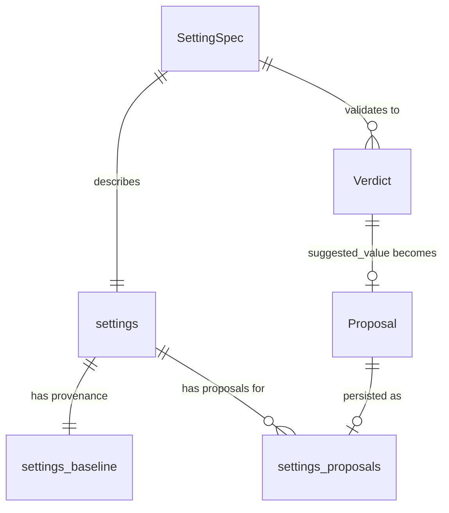

# Data Model: Amendment 002 — Settings Validator & LLM Helper

**Feature**: Amendment 002 | **Date**: 2026-07-26

## Entities

### SettingSpec (Immutable Metadata Record)

Defined in `trade/settings_schema.py`. Frozen dataclass — never modified at runtime.

| Field | Type | Description |
|---|---|---|
| `key` | `str` | Unique setting identifier (e.g., `"tp_min_pct"`, `"llm_helper_enabled"`) |
| `type` | `type` | Python type: `bool`, `int`, `float`, or `str` |
| `group` | `str` | Category: `trading`, `entry`, `exit`, `risk`, `toxicity`, `llm`, `mode` |
| `unit` | `str \| None` | Display unit: `"%"`, `"sec"`, `"x"`, `"min"`, `"$"`, `"days"`, `"calls/hr"`, `"samples"`, `"cycles"`, `"candles"`, `"z"`, or `None` |
| `hard_min` | `float \| None` | Absolute minimum — violation is `error` |
| `hard_max` | `float \| None` | Absolute maximum — violation is `error` |
| `soft_min` | `float \| None` | Recommended minimum — violation is `warn` |
| `soft_max` | `float \| None` | Recommended maximum — violation is `warn` |
| `short` | `str` | One-line human-readable description |
| `depends_on` | `tuple[str, ...]` | Keys that participate in cross-validation (reserved for future use; current cross-checks are hardcoded in validator) |

**Registry**: `ALL: list[SettingSpec]` — ordered list of all 51 settings.
**Lookup**: `BY_KEY: dict[str, SettingSpec]` — O(1) key → spec.

**Invariants**:
- Every key in `ALL` is unique.
- `hard_min <= soft_min` and `soft_max <= hard_max` where both are defined (enforced by code review, not runtime).
- `depends_on` entries reference keys that exist in `BY_KEY`.
- The registry is version-controlled and never mutated after import.

**51 settings across 7 groups**:
| Group | Count | Examples |
|---|---|---|
| `trading` | 7 | `assets`, `tp_min_pct`, `sl_min_pct`, `leverage`, `max_leverage` |
| `entry` | 8 | `dip_min_pct`, `pump_min_pct`, `cooldown_sec`, `adaptive_enabled` |
| `exit` | 2 | `max_hold_minutes_spot`, `max_hold_minutes_futures` |
| `risk` | 12 | `dex_slot_pct`, `min_net_edge_pct`, `atr_period`, `slope_threshold` |
| `toxicity` | 10 | `tox_window`, `spread_z_max`, `tox_velocity_enforce` |
| `llm` | 6 | `llm_helper_enabled`, `llm_language`, `llm_model`, `llm_timeout_sec` |
| `mode` | 6 | `dry_run`, `trading_enabled`, `auto_trade_binance`, `auto_trade_orderly` |

---

### Verdict (Validation Result)

Defined in `trade/settings_rules.py`. Returned by `validate()` and `validate_all()`.

| Field | Type | Description |
|---|---|---|
| `level` | `str` | `"ok"`, `"warn"`, or `"error"` |
| `message` | `str` | Human-readable explanation |
| `suggested_value` | `Any \| None` | Corrected value (only for `error`/`warn` verdicts with a computable fix) |

**State machine**: Verdicts are immutable. A setting's verdict is a pure function of `(spec, value, context)` — same inputs always produce the same verdict.

**Semantics**:
- `ok`: setting is valid. Trading may proceed.
- `warn`: setting is suspicious but not dangerous. Warning is logged and displayed; trading continues.
- `error`: setting is invalid or unsafe. Trading MUST NOT proceed until resolved.

---

### Proposal (LLM-Generated Suggestion)

Defined in `research/settings_llm.py`. Advisory only — never writes to `settings` table.

| Field | Type | Description |
|---|---|---|
| `key` | `str` | Setting key being proposed |
| `current_value` | `Any` | Value at proposal time |
| `proposed_value` | `Any` | Suggested new value |
| `reason` | `str` | 1-2 sentence justification |
| `evidence` | `list[str]` | Supporting data points |
| `confidence` | `str` | `"measured"` (data-driven), `"heuristic"` (rule-of-thumb), or `"no_basis"` (insufficient data) |

**Lifecycle**:
1. Generated by `propose()` — either deterministic (validator suggestions) or LLM-enhanced.
2. Written to `settings_proposals` table as `status='pending'`.
3. Operator reviews and accepts or rejects.
4. On accept: `status` → `'accepted'`, `decided_at` set. Operator manually applies the change via `/set`.
5. On reject: `status` → `'rejected'`, `decided_at` set.
6. Never expires — proposals remain in table indefinitely (retention policy deferred).

---

## Database Tables (Migration 003)

### `settings_baseline`

Provenance tracking for each setting's value. Separate from `settings` to preserve measurement history.

```sql
CREATE TABLE IF NOT EXISTS settings_baseline (
    key            TEXT PRIMARY KEY,       -- matches settings.key
    baseline_value TEXT NOT NULL,          -- the measured/default value
    status         TEXT NOT NULL DEFAULT 'unvalidated',  -- 'measured' | 'unvalidated' | 'overridden'
    evidence       TEXT,                   -- how baseline was determined (e.g., "dry-run 48h, 200+ cycles")
    updated_at     REAL NOT NULL           -- epoch timestamp
);
```

**Status values**:
| Status | Meaning | Set by |
|---|---|---|
| `unvalidated` | Default/placeholder value, never measured | Migration seed |
| `measured` | Value derived from live/dry-run data | Calibration tooling (future) |
| `overridden` | Operator manually changed a measured value | Telegram `/set` handler |

**Invariants**:
- Every setting in `settings` has exactly one row in `settings_baseline` (migration seeds all).
- `baseline_value` is immutable once `status='measured'` (operator override changes status to `overridden`, preserves original baseline).
- `updated_at` is set on every status change.

### `settings_proposals`

Append-only audit log of every LLM-generated proposal.

```sql
CREATE TABLE IF NOT EXISTS settings_proposals (
    id             INTEGER PRIMARY KEY AUTOINCREMENT,
    created_at     REAL NOT NULL,          -- epoch timestamp
    source         TEXT NOT NULL,          -- 'deterministic' | 'telegram' (LLM-enhanced)
    key            TEXT NOT NULL,          -- setting key
    current_value  TEXT NOT NULL,          -- value at proposal time
    proposed_value TEXT NOT NULL,          -- suggested new value
    reason         TEXT NOT NULL,          -- 1-2 sentence justification
    evidence       TEXT,                   -- JSON array of supporting data
    confidence     TEXT NOT NULL,          -- 'measured' | 'heuristic' | 'no_basis'
    status         TEXT NOT NULL DEFAULT 'pending',  -- 'pending' | 'accepted' | 'rejected'
    decided_at     REAL,                   -- epoch timestamp when accepted/rejected
    model          TEXT                    -- LLM model that generated the proposal
);

CREATE INDEX IF NOT EXISTS idx_proposals_status ON settings_proposals(status, created_at);
```

**Invariants**:
- Rows are INSERT-only. `status` and `decided_at` may be updated on operator decision, but `current_value`, `proposed_value`, `reason`, `evidence`, `confidence`, and `model` are immutable.
- `settings_proposals` NEVER writes to `settings`. Operator must manually apply accepted proposals.
- `source='deterministic'` rows come from validator `suggested_value` computation (no LLM call).
- `source='telegram'` rows include LLM-enhanced confidence grading.

---

## Entity Relationships



- `SettingSpec` → `settings`: one spec per setting key (51 keys, 51 specs).
- `settings` → `settings_baseline`: one-to-one (every setting has a baseline row).
- `settings` → `settings_proposals`: one-to-many (a setting can have multiple proposals over time).
- `Verdict.suggested_value` → `Proposal`: validator errors/warnings generate heuristic proposals.
