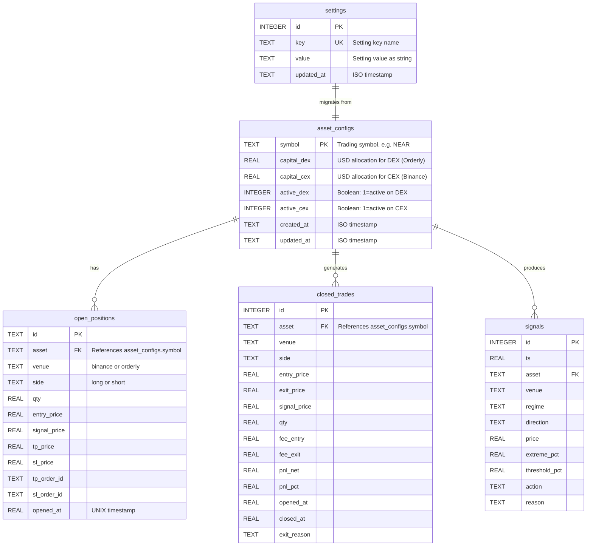
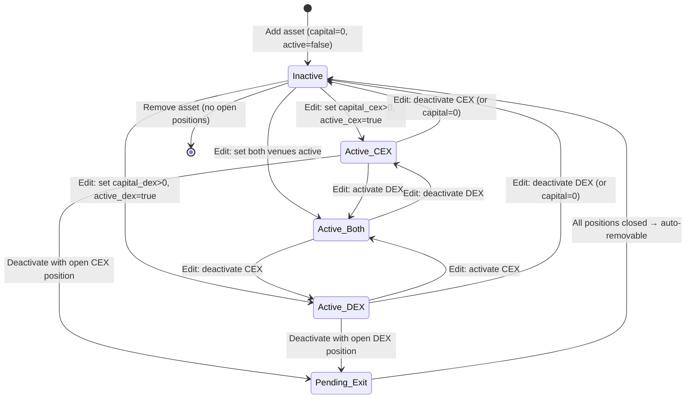

# Data Model: Multi-Asset Trading with Per-Asset Capital

**Feature**: 002-multi-asset-capital | **Date**: 2026-07-27

## Entity Relationship



## New Table: `asset_configs`

### DDL

```sql
CREATE TABLE IF NOT EXISTS asset_configs (
    symbol      TEXT PRIMARY KEY,
    capital_dex REAL NOT NULL DEFAULT 0.0,
    capital_cex REAL NOT NULL DEFAULT 0.0,
    active_dex  INTEGER NOT NULL DEFAULT 0,   -- SQLite boolean: 0 or 1
    active_cex  INTEGER NOT NULL DEFAULT 0,
    created_at  TEXT NOT NULL DEFAULT (datetime('now')),
    updated_at  TEXT NOT NULL DEFAULT (datetime('now'))
);
```

### Constraints & Defaults

| Column | Type | Constraint | Default | Description |
|--------|------|------------|---------|-------------|
| `symbol` | TEXT | PRIMARY KEY | — | Trading symbol, e.g. `NEAR`, `ETH`, `SOL`. Uniqueness enforced by PK. |
| `capital_dex` | REAL | NOT NULL | 0.0 | USD allocation for Orderly DEX futures trading. 0 = no DEX capital. |
| `capital_cex` | REAL | NOT NULL | 0.0 | USD allocation for Binance CEX spot trading. 0 = no CEX capital. |
| `active_dex` | INTEGER | NOT NULL | 0 | 1 = bot evaluates this asset on DEX. 0 = skipped. |
| `active_cex` | INTEGER | NOT NULL | 0 | 1 = bot evaluates this asset on CEX. 0 = skipped. |
| `created_at` | TEXT | NOT NULL | `datetime('now')` | ISO 8601 creation timestamp. |
| `updated_at` | TEXT | NOT NULL | `datetime('now')` | ISO 8601 last-update timestamp. |

### Validation Rules

| Rule | Level | Condition |
|------|-------|-----------|
| Symbol must be non-empty | Error | `symbol` is blank or whitespace-only |
| Symbol must be uppercase | Warn | `symbol != symbol.upper()` — suggest uppercase |
| Symbol must be unique | Error | Duplicate `symbol` on INSERT (PK constraint) |
| Capital must be ≥ 0 | Error | `capital_dex < 0` or `capital_cex < 0` |
| Active requires capital | Warn | `active_dex=1 AND capital_dex=0` — active with no capital is a no-op |
| Sum DEX capital ≤ DEX equity | Error | `SUM(capital_dex WHERE active_dex=1) > dex_equity` (FR-010) |
| Sum CEX capital ≤ CEX equity | Error | `SUM(capital_cex WHERE active_cex=1) > cex_equity` (FR-010) |
| Max active pairs | Warn | `COUNT(active_dex=1) + COUNT(active_cex=1) > max_active_pairs` |

### State Transitions



- **Pending Exit**: Asset is deactivated but has open positions. New entries blocked. Existing positions managed to exit. UI shows "deactivation pending — N position(s) open" (FR-012).
- **Removal**: Only allowed when `COUNT(open_positions WHERE asset=symbol) = 0` (FR-012a). Must go through deactivation first if positions exist.

## Modified Tables

### `settings` — Keys Removed

These keys are **deleted** during migration (FR-003, FR-015):

| Key | Reason |
|-----|--------|
| `assets` | Replaced by `asset_configs` table rows |
| `asset` | Legacy alias for single asset — removed |
| `dex_slot_pct` | Replaced by per-asset `capital_dex` |
| `cex_slot_pct` | Replaced by per-asset `capital_cex` |
| `auto_trade_binance` | Replaced by per-asset `active_cex` |
| `auto_trade_orderly` | Replaced by per-asset `active_dex` |
| `capital` | Legacy global capital — no equivalent, removed |

### `settings` — Keys Added

| Key | Type | Default | Description |
|-----|------|---------|-------------|
| `global_daily_loss_limit` | float | 0 (off) | Absolute USD or % loss across all pairs that disables all trading |
| `global_daily_loss_limit_pct` | float | 0 (off) | % of total portfolio equity; alternative to absolute limit |
| `max_active_pairs` | int | 6 | Maximum concurrently active (asset, venue) pairs |
| `max_concurrent_positions` | int | 9 | Maximum open positions across all pairs |

### `settings_schema.py` — SettingSpec Changes

**Removed from `ALL` list**:
- `SettingSpec("assets", ...)` — no longer a comma-separated string
- `SettingSpec("dex_slot_pct", ...)` — no longer global
- `SettingSpec("cex_slot_pct", ...)` — no longer global
- `SettingSpec("auto_trade_binance", ...)` — no longer global
- `SettingSpec("auto_trade_orderly", ...)` — no longer global

**Added to `ALL` list**:
- `SettingSpec("global_daily_loss_limit", float, "risk", "$", 0, None, None, None, "Stop all trading if total daily PnL across all pairs drops below this")`
- `SettingSpec("global_daily_loss_limit_pct", float, "risk", "%", 0, 100, 1, 20, "Stop all trading if total daily PnL% drops below this")`
- `SettingSpec("max_active_pairs", int, "risk", "pairs", 1, 50, 2, 12, "Maximum concurrently active (asset, venue) pairs")`
- `SettingSpec("max_concurrent_positions", int, "risk", "positions", 1, 50, 2, 20, "Maximum open positions across all pairs")`

### Existing Tables — No Schema Changes

`open_positions`, `closed_trades`, and `signals` already have `asset` and `venue` columns. No schema changes needed. Migration does not touch their rows.

## `AssetManager.tsx` — State Interface Change

```typescript
// Before
interface AssetData {
  assets: string[]          // comma-separated list
  current_asset: string     // the "active" asset (singular)
}

// After
interface AssetConfig {
  symbol: string
  capital_dex: number
  capital_cex: number
  active_dex: boolean
  active_cex: boolean
  open_positions: number    // count from open_positions table
}

interface AllocationSummary {
  venue: string             // "binance" | "orderly"
  total_allocated: number
  active_pairs: number
  remaining: number
}

interface AssetData {
  assets: AssetConfig[]
  summary: AllocationSummary[]
}
```
