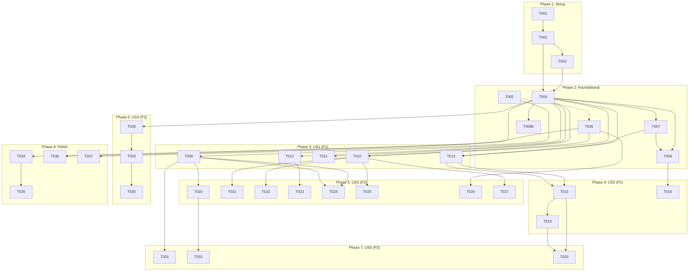

# Tasks: Multi-Asset Trading with Per-Asset Capital and Independent CEX/DEX Activation

**Input**: Design documents from `/specs/002-multi-asset-capital/`

**Prerequisites**: plan.md ✅, spec.md ✅, research.md ✅, data-model.md ✅, contracts/api.md ✅, quickstart.md ✅

**Tests**: Not explicitly requested in the feature specification. Test tasks are omitted.

**Organization**: Tasks are grouped by user story to enable independent implementation and testing of each story.

## Format: `[ID] [P?] [Story] Description`

- **[P]**: Can run in parallel (different files, no dependencies)
- **[Story]**: Which user story this task belongs to (e.g., US1, US2, US3)
- Include exact file paths in descriptions

## Path Conventions

- **Trading bot**: `bot.py`, `trading_bot/`, `trade/`, `db/`
- **Dashboard API**: `dashboard/main.py`
- **Dashboard UI**: `dashboard-ui/src/`
- **Telegram bot**: `telegram.py`
- **Database**: `db/schema_v2.sql`, `db/migrations/`

---

## Phase 1: Setup (Shared Infrastructure)

**Purpose**: Database schema changes — the `asset_configs` table and migration file

- [X] T001 Create migration 004 SQL file at `db/migrations/004_multi_asset.sql` with `asset_configs` table DDL per data-model.md §New Table
- [X] T002 Update `db/schema_v2.sql` to add `CREATE TABLE IF NOT EXISTS asset_configs` block (idempotent) per data-model.md DDL
- [X] T003 Add `asset_configs` table initialization to `_run_schema_v2()` in `db/db_ops.py` by executing the migration SQL in `initialize_database_tables()`

---

## Phase 2: Foundational (Blocking Prerequisites)

**Purpose**: Core data access layer and validation — asset CRUD, settings schema changes, validation rules. MUST complete before any user story.

**⚠️ CRITICAL**: No user story work can begin until this phase is complete

- [X] T004 Add `asset_configs` CRUD functions to `db/db_ops.py`: `get_all_asset_configs() -> list[dict]`, `get_asset_config(symbol: str) -> dict | None`, `upsert_asset_config(symbol, capital_dex, capital_cex, active_dex, active_cex)`, `delete_asset_config(symbol: str)`, `get_active_pairs() -> list[tuple[str, str, float]]` (returns list of (asset, venue, capital) for pairs with active=true AND capital>0)
- [X] T005 [P] Update `trade/settings_schema.py` — remove legacy `SettingSpec` entries for `assets`, `dex_slot_pct`, `cex_slot_pct`, `max_slots`, `auto_trade_binance`, `auto_trade_orderly`; add new entries for `global_daily_loss_limit`, `global_daily_loss_limit_pct`, `max_active_pairs`, `max_concurrent_positions` per data-model.md §SettingsSpec Changes. `max_concurrent_positions` replaces the old `max_slots` (same default of 9).
- [X] T006 [P] Add per-asset capital validation rules to `trade/settings_rules.py`: overallocation check (sum capital ≤ equity per venue), active-without-capital warning, max_active_pairs warning per research.md §7. Extend `SettingsContext` to accept asset list and per-venue equity.
- [X] T007 Update `trade/pnl.py` `compute_slot_size()` — change signature to `compute_slot_size(asset, venue, capital, equity, min_notional)` using absolute USD capital instead of percentage-based `{venue}_slot_pct` per research.md §4
- [ ] T008 Update `trade/pnl.py` — add `is_entry_blocked_per_pair(asset, venue, equity)` and `get_global_daily_pnl()` for global kill switch per research.md §5; keep backward-compatible `is_entry_blocked()` wrapper
- [X] T008b [P] Implement startup reconciliation in `bot.py` — before entering the main loop, query exchange open positions and orders for ALL active (asset, venue) pairs via `get_active_pairs()`; for each pair: adopt positions with no local DB record, re-attach stops to any position missing one, close DB records with no matching exchange position per Constitution VI

**Checkpoint**: Foundation ready — `asset_configs` table exists, CRUD functions work, settings schema updated, validation rules active, position sizing uses absolute capital. User story implementation can now begin in parallel (US1 and US2 can start concurrently once foundation is done).

---

## Phase 3: User Story 1 — Configure a New Asset with Own Capital and Venue Activation (Priority: P1) 🎯 MVP

**Goal**: Operator can add/edit/remove assets with per-venue capital and activation flags via the Dashboard API. The bot picks up changes within one cycle.

**Independent Test**: `curl POST /api/assets` with symbol + capital + flags → verify asset appears in `GET /api/assets` list → verify bot evaluates only active venues in logs.

### Implementation for User Story 1

- [X] T009 [US1] Implement `GET /api/assets` in `dashboard/main.py` — return all `asset_configs` rows with `open_positions` count per asset, plus allocation summary per venue (total allocated, active pairs, remaining balance) per contracts/api.md
- [X] T010 [US1] Implement `POST /api/assets` in `dashboard/main.py` — validate symbol (non-empty, no duplicate), capital ≥ 0, overallocation check via `settings_rules.validate()` per contracts/api.md; insert via `upsert_asset_config()`
- [X] T011 [US1] Implement `PUT /api/assets/{symbol}` in `dashboard/main.py` — partial update of capital/flags, re-validate after change, reject deactivation-to-removal if open positions exist per FR-012a
- [X] T012 [US1] Implement `DELETE /api/assets/{symbol}` in `dashboard/main.py` — block if `load_all_positions(asset=symbol)` returns any rows; return 409 per contracts/api.md; otherwise delete via `delete_asset_config()`
- [ ] T013 [US1] Update `bot.py` main loop — replace `get_asset_list()` + `auto_trade_binance`/`auto_trade_orderly` booleans with `get_active_pairs()` iteration; each pair uses its own `capital_<venue>` for `compute_slot_size()` per research.md §3
- [X] T014 [P] [US1] Update `bot.py` `validate_startup()` — add check that at least one active pair exists (warn, not error); remove references to legacy `auto_trade_*` keys; validate `max_active_pairs` and `max_concurrent_positions` settings

**Checkpoint**: At this point, a single asset with per-venue capital and activation flags can be added via API, the bot evaluates it correctly, and removal is blocked if positions exist. This is the MVP — a single asset operates identically to the legacy single-asset mode.

---

## Phase 4: User Story 2 — Run Multiple Assets Simultaneously on Both Venues (Priority: P1)

**Goal**: Multiple assets trade independently. Each (asset, venue) pair has isolated state — cooldowns, regime, kill switches. One pair's failure does not block others.

**Independent Test**: Configure 3 assets with both venues active. Verify bot logs show evaluation of all 6 pairs per cycle. Verify a losing streak on BTC/DEX does not block ETH/CEX from entering.

### Implementation for User Story 2

- [X] T015 [US2] Refactor `bot.py` main loop — flat pair iteration with per-pair `try/except` isolation per research.md §3; each pair independently calls `manage_open_positions()` then `scalp_cycle()`; a `logger.error` on one pair does not abort the loop. Track consecutive cycle failures per venue; if ≥5 consecutive failures across all pairs on a venue, disable that venue via `upsert_setting` and notify Telegram per Constitution IV.
- [ ] T016 [US2] Update `trade/pnl.py` — `get_daily_pnl()` and `get_consecutive_losses()` accept optional `asset` parameter for per-pair scoping per research.md §5; implement `check_global_daily_loss()` that sums PnL across all pairs and disables `trading_enabled` if global limit breached
- [ ] T017 [US2] Verify and document per-pair state isolation in `trading_bot/spot_scalper.py` — confirm `_price_memory[asset]`, `_last_entry[f"{venue}:{asset}:{side}"]`, and `_peak`/`_trough` dicts are correctly keyed per (asset, venue). No code changes expected — existing design already per-asset
- [ ] T018 [US2] Verify and document per-pair state isolation in `trading_bot/futures_scalper.py` — same verification as T017 for futures scalper module-level dicts. No code changes expected
- [ ] T019 [US2] Update `bot.py` cycle-level logic — skip exchange equity queries for venues with zero active pairs (avoid wasted API calls); add `max_concurrent_positions` enforcement: count `load_all_positions()` across all pairs, block new entries if limit reached

**Checkpoint**: Multiple assets trade simultaneously. Each pair is independently evaluated with isolated state. Global kill switch protects portfolio. Max position/pair limits enforced.

---

## Phase 5: User Story 3 — Manage Assets with Full Parity Across Telegram and Mini App (Priority: P2)

**Goal**: Both Telegram bot and Mini App UI expose the same asset management operations (add, edit, list, remove) with the new per-asset capital and flags fields.

**Independent Test**: Add asset via Telegram → verify in Mini App. Edit capital via Mini App → verify in Telegram. Remove via Telegram → verify gone from Mini App.

### Implementation for User Story 3

- [ ] T020 [US3] Add `/assets` command to `telegram.py` — inline keyboard showing asset list with DEX/CEX capital, active status (✅/❌), and open position count per contracts/api.md Telegram Bot Contract
- [ ] T021 [US3] Add multi-step "Add Asset" flow to `telegram.py` — prompt for symbol → CEX capital → DEX capital → activate CEX? (Yes/No) → activate DEX? (Yes/No) → validate via `settings_rules` → save via `upsert_asset_config()` per contracts/api.md
- [ ] T022 [US3] Add "Edit Asset" flow to `telegram.py` — select asset from inline list → show current values → inline buttons to edit each field (symbol not editable) → re-validate on each change
- [ ] T023 [US3] Add "Remove Asset" flow to `telegram.py` — select asset → check open positions → block with message if positions exist → confirm deletion if flat → remove via `delete_asset_config()`
- [ ] T024 [P] [US3] Rewrite `dashboard-ui/src/AssetManager.tsx` — replace comma-separated asset list with `AssetConfig[]` interface per data-model.md §TypeScript; each asset card shows symbol, DEX capital, CEX capital, active toggles per venue, open position count
- [ ] T025 [P] [US3] Add edit form to `dashboard-ui/src/AssetManager.tsx` — inline editing of capital values and venue toggles; save button triggers `PUT /api/assets/{symbol}`; add form triggers `POST /api/assets`
- [ ] T026 [US3] Implement `POST /api/assets/validate` in `dashboard/main.py` — dry-run validation without saving per contracts/api.md; used by Mini App for inline validation feedback
- [ ] T027 [US3] Implement `POST /api/assets/{symbol}/force-save` in `dashboard/main.py` — skip balance check, log override prominently, return `force_saved: true` flag per contracts/api.md

**Checkpoint**: Telegram and Mini App have full asset CRUD parity. Operator can manage assets from either interface interchangeably. Validation messages are consistent across both UIs.

---

## Phase 6: User Story 4 — Migrate from Legacy Global Capital to Per-Asset Model (Priority: P2)

**Goal**: Existing installations with global `dex_slot_pct` / `cex_slot_pct` / `auto_trade_*` settings migrate automatically on first startup. No data loss. Migration is idempotent.

**Independent Test**: Set up legacy settings in DB, start bot, verify `asset_configs` populated, legacy keys deleted, historical data untouched.

### Implementation for User Story 4

- [X] T028 [US4] Implement migration function `migrate_legacy_assets()` in `db/db_ops.py` — detect legacy keys (`dex_slot_pct`, `cex_slot_pct`), query exchange equity, compute `capital = slot_pct / 100 * equity`, insert first asset row with computed capital + legacy flags, insert remaining assets with zero capital + inactive per research.md §2 and spec FR-013/FR-014
- [ ] T029 [US4] Wire migration into `initialize_database_tables()` in `db/db_ops.py` — check `SELECT COUNT(*) FROM asset_configs`; if 0 rows AND legacy keys exist, run `migrate_legacy_assets()`; after migration, delete legacy keys via `DELETE FROM settings WHERE key IN (...)` per FR-015; idempotency: if `asset_configs` already has rows, skip entirely
- [ ] T030 [US4] Add migration summary logging in `db/db_ops.py` — log asset count, capital assigned, flag state per asset; send Telegram notification via `trading_bot/send_bot_message.py` if available, else log only per FR-015. Verify `open_positions`, `closed_trades`, `signals` rows are untouched (assertion or manual check per FR-016)

**Checkpoint**: Upgrading from legacy to multi-asset is a single startup. Operator sees migration summary. All historical data preserved. Migration never runs twice.

---

## Phase 7: User Story 5 — Monitor Capital Allocation and Guardrails (Priority: P3)

**Goal**: Operator sees per-venue capital allocation summary: total allocated, active pair count, remaining unallocated balance. Overallocation is blocked at save time. Concurrency limits are visible.

**Independent Test**: Configure 3 assets with varying capital. Verify summary in both UIs shows correct totals and remaining. Verify save is blocked when exceeding balance.

### Implementation for User Story 5

- [ ] T031 [US5] Implement allocation summary computation in `dashboard/main.py` `GET /api/assets` — query exchange equity for each venue, compute `total_allocated = SUM(capital WHERE active)`, `remaining = equity - total_allocated`, `active_pairs = COUNT(active)` per contracts/api.md; if balance query fails, set `remaining: null` and `balance_error` per venue
- [ ] T032 [P] [US5] Add allocation summary display to `telegram.py` `/assets` list — show per-venue line: "CEX: $X allocated / $Y remaining (N assets)" per spec US5 acceptance scenarios
- [ ] T033 [US5] Add `max_active_pairs` enforcement to `bot.py` — at cycle start, count active pairs from `get_active_pairs()`; if `len(pairs) > max_active_pairs`, log warning and iterate only up to the limit (order by symbol alphabetically for deterministic behavior). Add `max_concurrent_positions` enforcement (already in T019 — verify and cross-reference)

**Checkpoint**: Capital allocation is fully visible and guarded. Operator can see at a glance how capital is deployed. Overallocation and concurrency violations are caught before trading.

---

## Phase 8: Polish & Cross-Cutting Concerns

**Purpose**: Final validation, line budget check, constitution compliance audit, edge case verification.

- [ ] T034 Update `validate_all()` in `trade/settings_rules.py` to include per-asset capital checks — iterate `get_all_asset_configs()`, validate each row's capital/flags against the new rules from T006
- [ ] T035 Update `validate_startup()` in `bot.py` — run T034's per-asset validation as part of the startup gate; if any asset has error-level violations, refuse to trade
- [ ] T036 Remove legacy `get_asset_list()`, `add_asset()`, `remove_asset()` functions from `db/db_ops.py` — replaced by `asset_configs` CRUD; verify no remaining callers (check `telegram.py`, `bot.py`, `dashboard/main.py`)
- [ ] T037 Remove legacy `assets` setting key references from `trade/settings_schema.py` and `trade/settings_rules.py` — ensure no code path reads the old comma-separated string
- [ ] T038 Verify Constitution compliance — audit each of the 8 principles against the implemented changes per plan.md post-design re-check table; document any deviations
- [ ] T039 Run quickstart.md scenarios 1–7 end-to-end — verify all pass in dry-run mode; fix any failures
- [ ] T040 Line budget verification — count lines in `bot.py`, `regime.py`, `pnl.py`, `executor.py`, `spot_scalper.py`, `futures_scalper.py`; confirm total ≤ 1,500 (Constitution VII)

---

## Dependencies



**Key**:
- Solid arrow: blocking dependency (must complete before)
- Dotted arrow: parallel-friendly (can start after, but not blocking)

## Parallel Execution Examples

### Within Phase 2 (Foundational)
```bash
# These can run concurrently:
Task T005: "Update trade/settings_schema.py"
Task T006: "Add per-asset validation rules to trade/settings_rules.py"
```

### Within Phase 5 (US3 — UI Parity)
```bash
# Backend (Telegram) and Frontend (Mini App) can run concurrently:
Task T020-T023: "Telegram asset management handlers"
Task T024-T025: "AssetManager.tsx rewrite"
```

### Across Phases (after Foundation)
```bash
# Once Phase 2 is complete, US1 and US4 can start in parallel:
Phase 3 (US1): Core API + bot loop
Phase 6 (US4): Migration logic
# US4 only needs T004 (CRUD functions), not the API endpoints
```

## Implementation Strategy

### MVP First (User Story 1 Only)
1. Complete Phase 1 (Setup) — DB schema
2. Complete Phase 2 (Foundational) — CRUD + validation
3. Complete Phase 3 (US1) — Single asset with per-venue capital via API
4. **STOP and VALIDATE**: Single asset operates identically to legacy mode
5. Deploy/demo if ready

### Incremental Delivery
1. MVP (US1) → Single asset, per-venue capital, API only
2. +US2 → Multiple assets simultaneously, independent state
3. +US3 → Full UI parity (Telegram + Mini App)
4. +US4 → Migration for existing installations
5. +US5 → Capital monitoring & guardrails
6. Polish → Validation cleanup, constitution audit, line budget check

### Risk Mitigation
- **Largest risk**: Multi-asset loop opening too many positions → mitigated by `max_active_pairs=6` and `max_concurrent_positions=9` defaults, enforced in T019/T033
- **Second risk**: Migration data loss → mitigated by idempotent design (T029) and zero-touch on existing tables (FR-016)
- **Third risk**: Rate limit on exchange API → mitigated by `max_active_pairs` cap (research.md §6)

---

## Summary

| Phase | Stories | Task Count | Parallel Tasks |
|-------|---------|------------|----------------|
| Phase 1: Setup | — | 3 | 0 |
| Phase 2: Foundational | — | 6 | T005, T006, T008b |
| Phase 3: US1 (P1) | Configure Asset | 6 | T014 |
| Phase 4: US2 (P1) | Multi-Asset Trading | 5 | T017, T018 |
| Phase 5: US3 (P2) | UI Parity | 8 | T024, T025 |
| Phase 6: US4 (P2) | Migration | 3 | — |
| Phase 7: US5 (P3) | Monitoring | 3 | T032 |
| Phase 8: Polish | — | 7 | T038, T039, T040 |
| **Total** | **5 stories** | **41 tasks** | **9 parallelizable** |

**MVP Scope**: Phases 1–3 (15 tasks) — single asset with per-venue capital, operational via API.
