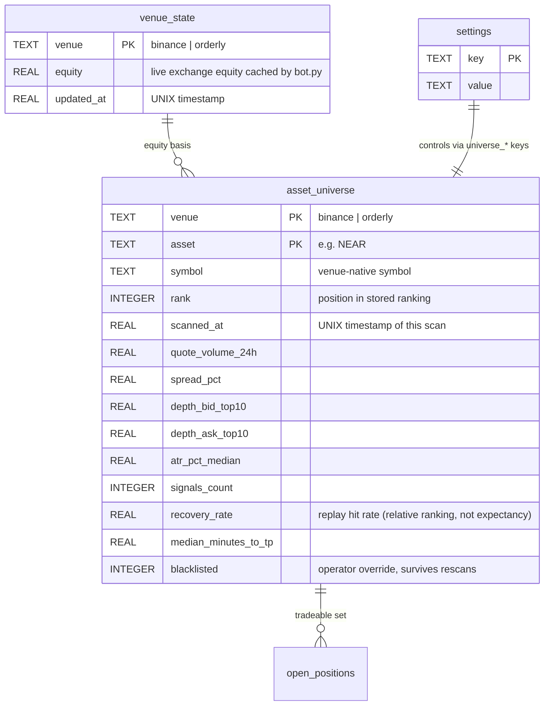

# Data Model: Dynamic Asset Universe & Capital View

**Feature**: 003-dynamic-asset-universe-capital | **Date**: 2026-08-04

## Entity Relationship



## New Tables

### `asset_universe`

One row per venue per asset. Replaced wholesale on each scan (`replace_universe`).
`blacklisted` is carried forward by `(venue, asset)` so the operator's override
survives a rescan. `rank` is re-numbered 1..N in stored order.

```sql
CREATE TABLE IF NOT EXISTS asset_universe (
    venue                TEXT    NOT NULL,      -- 'binance' | 'orderly'
    asset                TEXT    NOT NULL,
    symbol               TEXT    NOT NULL,      -- venue-native
    rank                 INTEGER NOT NULL,
    scanned_at           REAL    NOT NULL,
    quote_volume_24h     REAL,
    spread_pct           REAL,
    depth_bid_top10      REAL,
    depth_ask_top10      REAL,
    atr_pct_median       REAL,
    signals_count        INTEGER,
    recovery_rate        REAL,
    median_minutes_to_tp REAL,
    blacklisted          INTEGER NOT NULL DEFAULT 0,
    PRIMARY KEY (venue, asset)
);
CREATE INDEX IF NOT EXISTS idx_universe_rank ON asset_universe(venue, rank);
```

### `venue_state`

Live equity cache written by `bot.py` each cycle (`set_venue_equity`) and read by
the Capital view. This is how the dashboard shows live equity without holding
exchange credentials.

```sql
CREATE TABLE IF NOT EXISTS venue_state (
    venue      TEXT PRIMARY KEY,
    equity     REAL NOT NULL DEFAULT 0.0,
    updated_at REAL NOT NULL
);
```

## Settings Changes (Amendment 003)

| Key | Type | Default | Purpose |
|---|---|---|---|
| `universe_scan_interval_hours` | int | 24 | Scan cadence |
| `universe_max_age_hours` | int | 36 | Stale threshold — blocks entries |
| `universe_size` | int | 20 | Top-N stored per venue |
| `universe_min_volume_usd` | float | 5000000 | Stage-2 volume floor |
| `universe_spread_ratio_max` | float | 0.10 | Spread ≤ tp_min × this |
| `universe_rank_min` / `_max` | int | 15 / 90 | Volume-rank band |
| `universe_depth_slot_multiple` | float | 3 | Depth ≥ multiple × slot |
| `universe_replay_days` | int | 7 | Replay window |
| `universe_min_signals` | int | 20 | Minimum replay entries |
| `universe_min_recovery_rate` | str | `auto` | `auto` = breakeven `(sl+fee)/(tp+sl)`; literal overrides |
| `universe_spread_degradation_multiple` | float | 3 | Per-cycle spread guard |
| `capital_cex_usdt` / `capital_dex_usdc` | float | 0 | Declared pools (display only) |
| `max_slots_cex` / `max_slots_dex` | int | 9 | Per-venue slot caps |

Fees stay per-venue (`dex_round_trip_fee_pct` / `cex_round_trip_fee_pct`) and
drive every net-edge calculation. The legacy global `fee_round_trip_pct` key is
deleted defensively by the migration (it never existed on this codebase).

`cex_slot_pct` / `dex_slot_pct` (per-venue slot % of live equity) are reused from
Amendment 001 — they pre-exist in `schema_v2.sql` and are not re-seeded here.

`asset_configs` (Amendment 004) is now **legacy read-only data** — not read by
the bot loop, Telegram, or the Capital view. Kept for data preservation.
